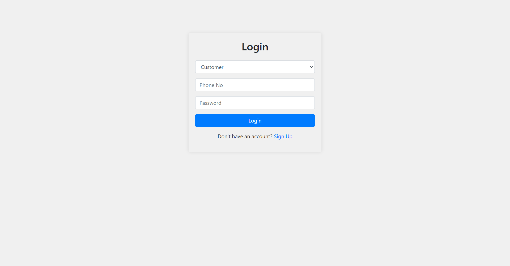
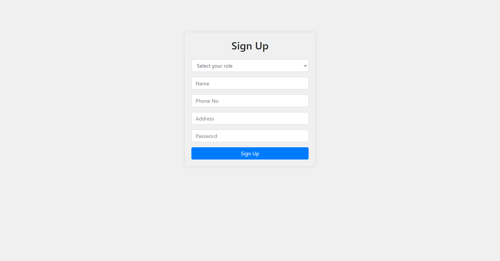
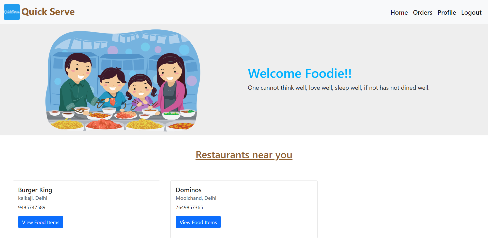
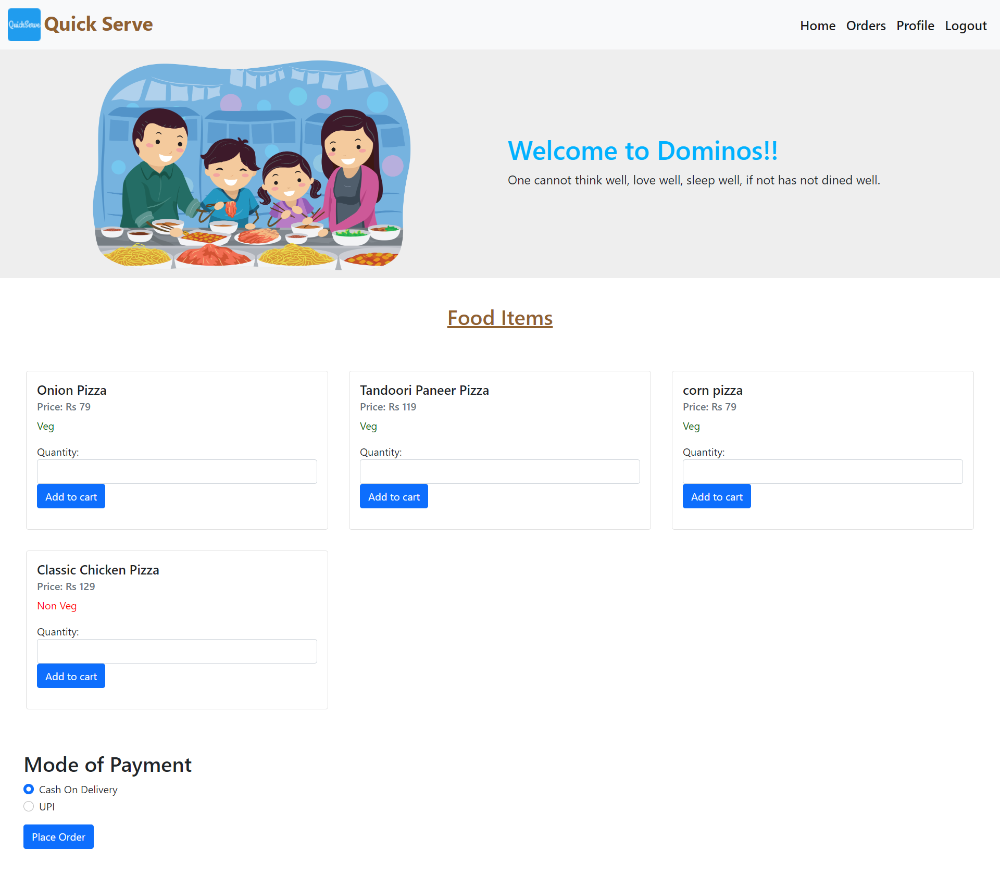
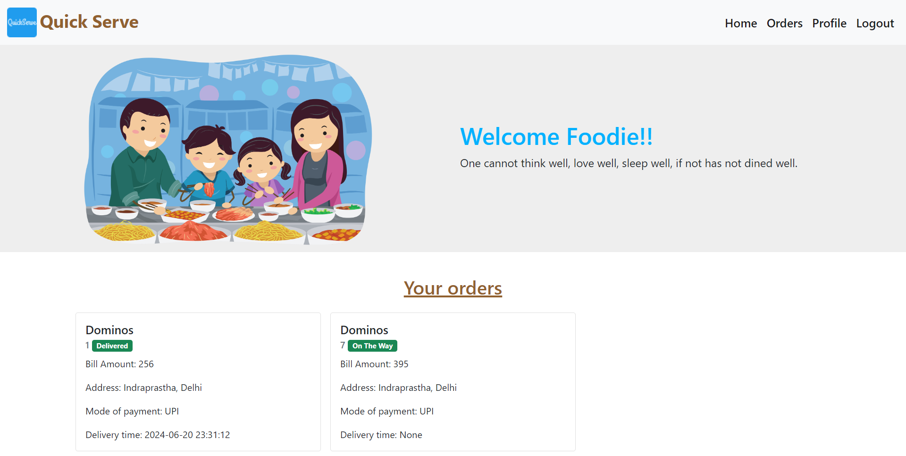
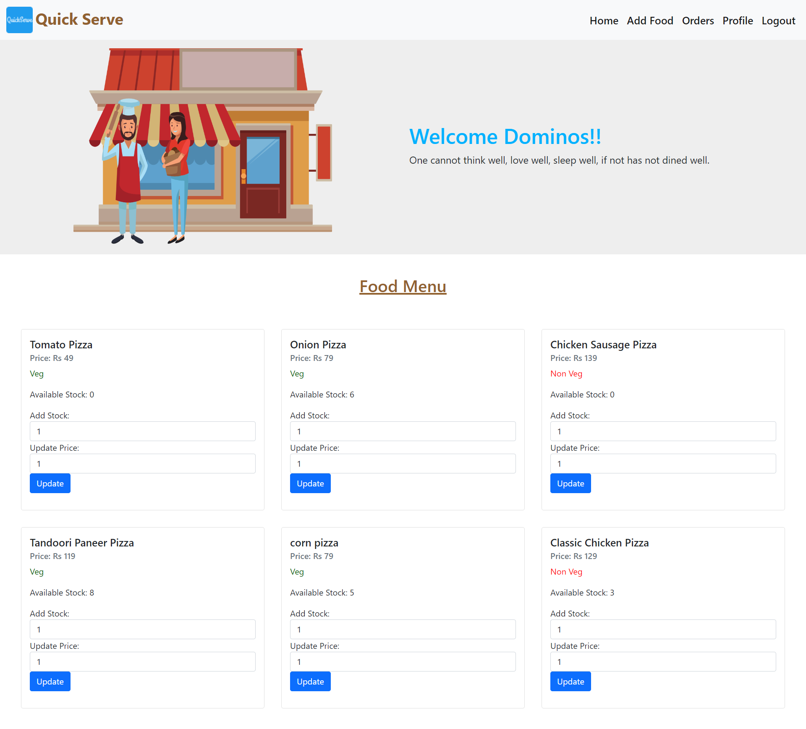
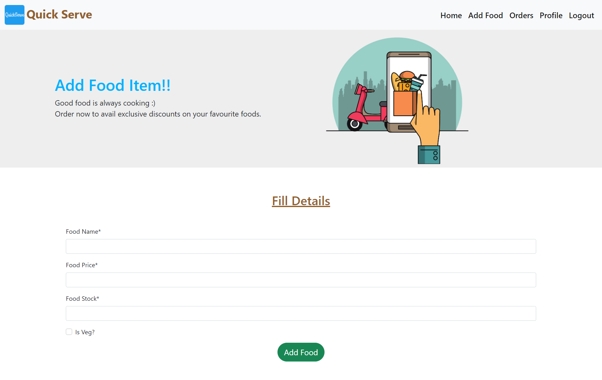
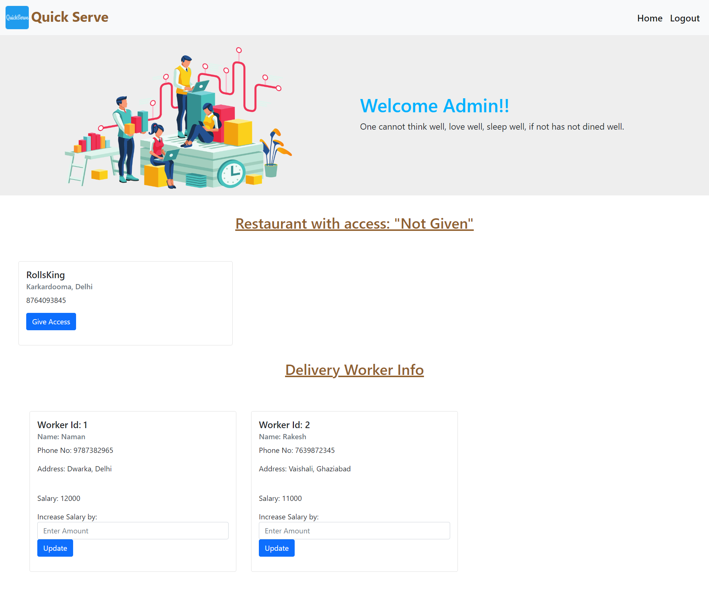

# Quick Serve

## About the Project
Online shopping has revolutionized how we purchase goods, offering numerous benefits that make it an attractive alternative to traditional brick-and-mortar stores. QuickServe is a fast, reliable, and convenient way to deliver your favorite meals to your doorstep. It is an online shopping platform that helps restaurants list food items and allows customers to browse and purchase them. 

This project is part of the Database Management System course at IIIT-Delhi. **Mysql** has been used for storage, **flask** for the backend, and **HTML** and **CSS** have been used for the front end.

## Setup

- Open your **Terminal / Cmd**
 ```
 git clone "https://github.com/Acash005/QuickServe.git" 
 ```
- Make sure you have installed MySQL and MySQL workbench on your system. Also, make sure you have installed Flask and MySQL.connector in Python.

#### Load MySQL data on your system

- Import the QuickServe database using the "SQL Data" file.
- In MySQL workbench, use the **import data** option in **server tab**.
- Select **Import from self-contained file** and select the location of the **SQL Data** file in the QuickServe repository.
- Make sure in QuickServe/app.py that you are using your own username and password to connect to MySQL.

#### Running the application 

- Open your **Terminal / Cmd**
 ```
 cd QuickServe
 python app.py 
 ```

## Screenshots of the Application

<p align ="center">
    
</p>
<p align ="center">
    
</p>
<p align ="center">
    
</p>
<p align ="center">
    
</p>
<p align ="center">
    
</p>
<p align ="center">
    
</p>
<p align ="center">
    
</p>
<p align ="center">
    
</p>
<p align ="center">
    
</p>
